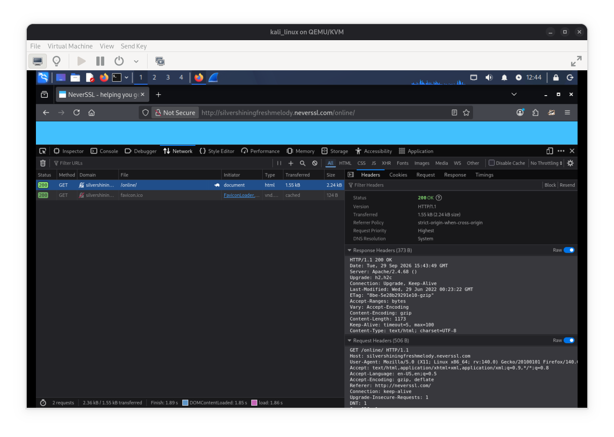
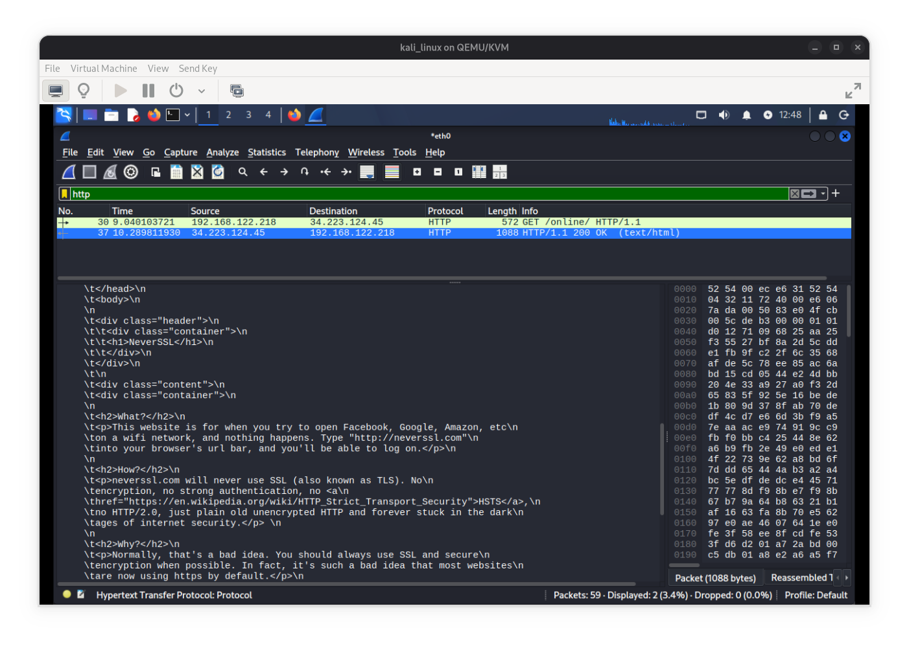
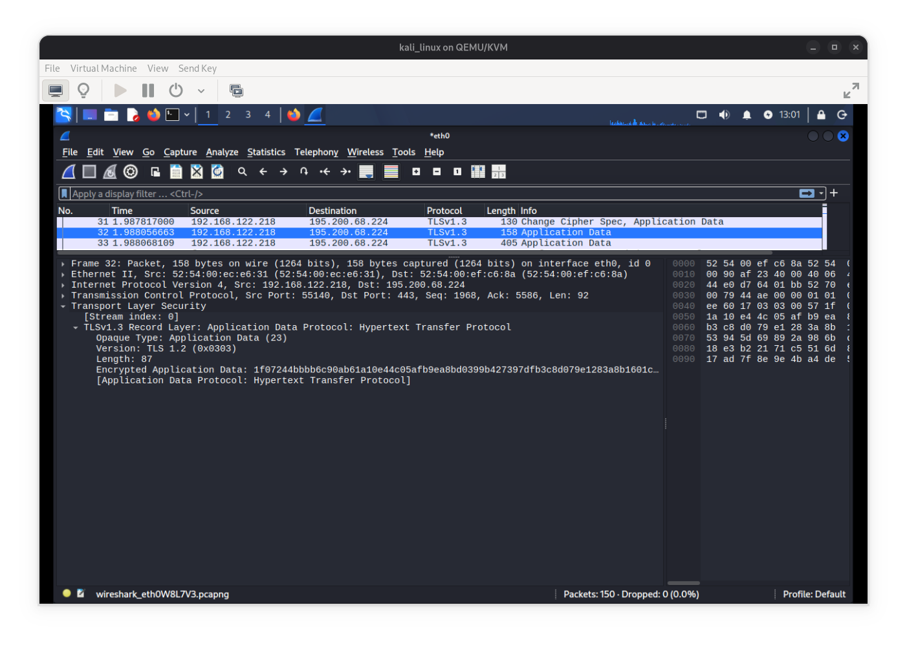
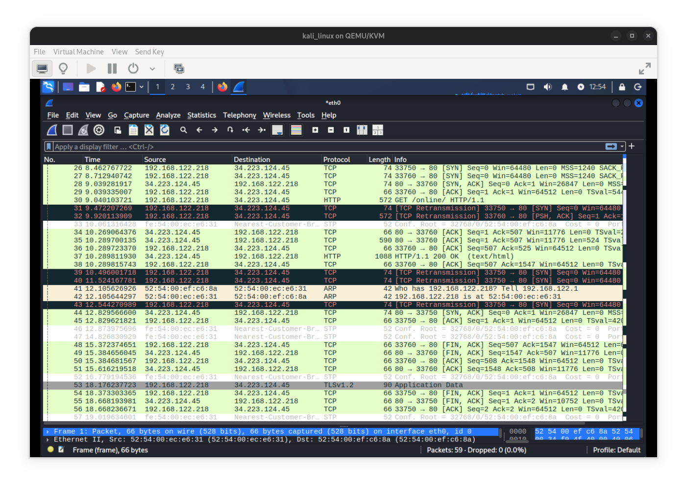
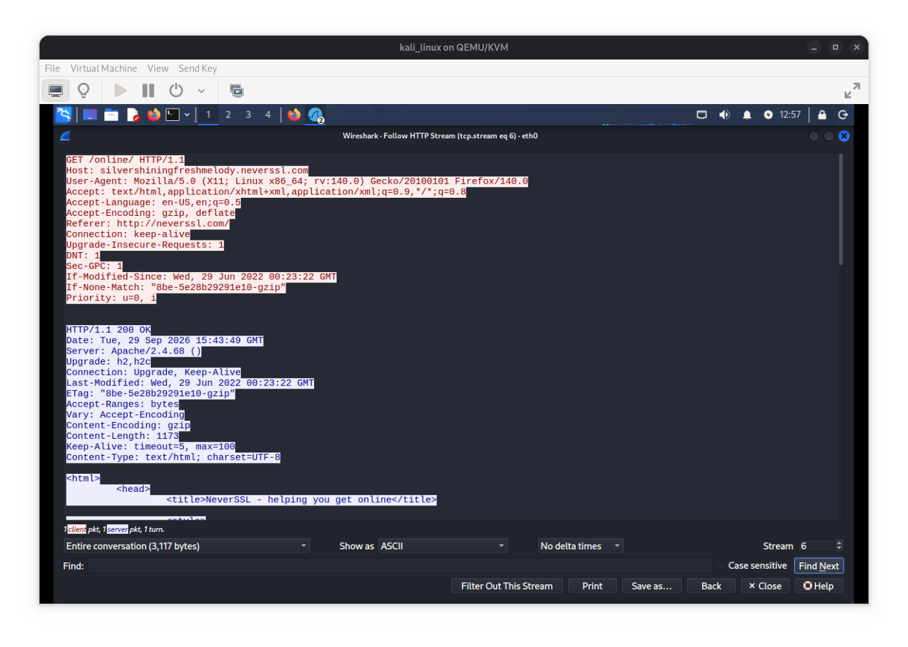
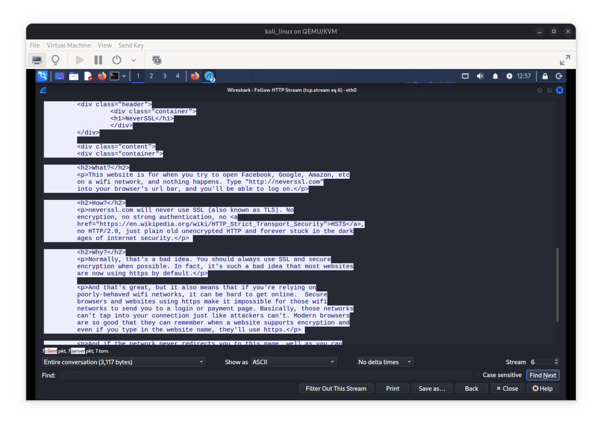
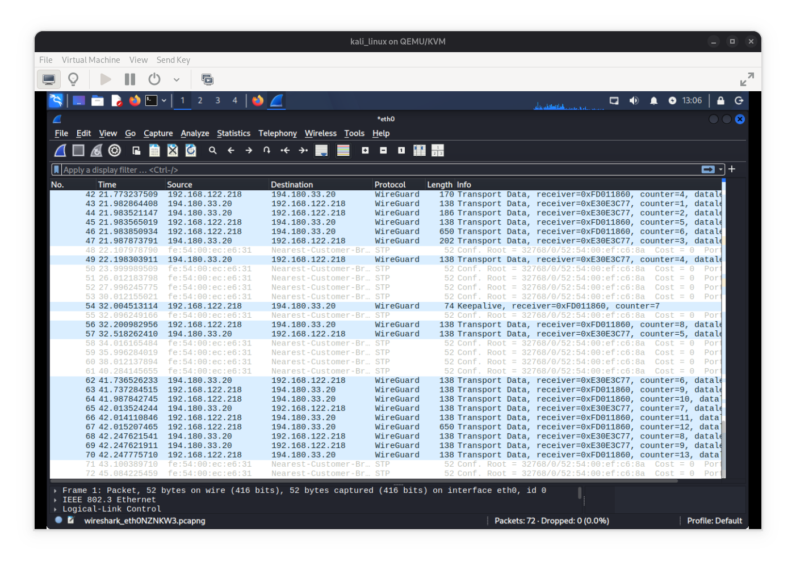
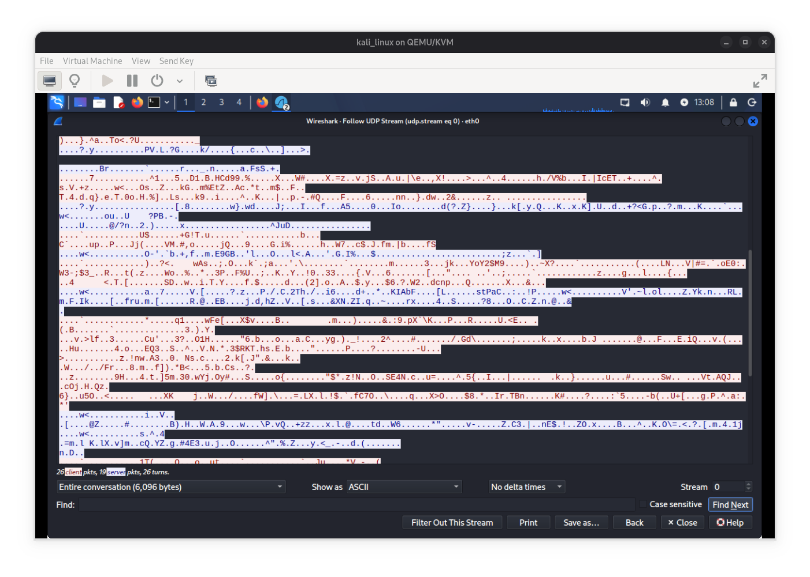

# Reporte Técnico: Análisis de Riesgos en Conexiones HTTP y Estrategias de Mitigación en Redes Abiertas
por Mariano Codutti Alarcón

ACLARACIÓN IMPORTANTE: El ejercicio fue realizado utilizando el navegador Mozilla Firefox dentro de un entorno virtualizado con Kali Linux. El objetivo principal consiste en auditar el tráfico HTTP sin cifrar en un escenario de red no segura y evaluar las medidas de protección necesarias frente a amenazas en redes Wi-Fi públicas.

## SITIO ANALIZADO Y ENTORNO DE PRUEBA
* **URL del sitio:** `http://neverssl.com`
* **Protocolo utilizado:** HTTP/1.1 (sin cifrado TLS)
* **Herramienta de auditoría:** Herramientas de desarrollador del navegador (Pestaña *Network/Red*)

## INSPECCIÓN Y DETALLE TÉCNICO DE SOLICITUDES EN TEXTO PLANO
Al realizar la petición al sitio sin cifrar, la totalidad del contenido del paquete HTTP viaja en texto plano a través del medio de transmisión. Mediante la inspección del tráfico se registraron los siguientes parámetros y cabeceras de red:

* **User-Agent:** Expone la arquitectura del sistema operativo (`Linux x84_64`), la versión exacta del navegador (`Gecko/20100101 Firefox/140.0`) y demás información que facilita al atacante el perfilado del objetivo (*fingerprinting*) para eventuales vulnerabilidades específicas del software.
* **Host:** Indica diréctamente el dominio de destino en texto claro, permitiendo que cualquier intermediario de la red (routers, ISP o atacantes en el medio) reconozca los sitios que el usuario visita, incluso sin analizar el cuerpo del paquete.
* **Accept/Accept-Language/Accept-Encoding:** Revela los tipos de MIME aceptados por el navegador, la configuración regional/idioma del usuario y los algoritmos de compresión soportados (`gzip`, `deflate`), enriqueciendo la huella digital.

## TEXTO PLANO VS. CIFRADO TLS (HTTPS)
La diferencia estructural entre HTTP y HTTPS radica en la capa de seguridad de transporte:

* **HTTP:** La comunicación ocurre en la capa de aplicación sobre TCP sin ningún nivel de codificación o cifrado. Cualquier dispositivo intermedio en la ruta puede leer, alterar o inyectar paquetes.

* **HTTPS:** Incorpora el protocolo TLS entre la capa de transporte y la capa de aplicación, garantizando 3 pilares fundamentales de la seguridad informática: Confidencialidad, Integridad y Autenticidad.

## SOLUCIONES Y ESTRATEGIAS DE MITIGACIÓN: USO DE VPN
El despliegue de un túnel VPN en redes no confiables mitiga de forma integral riesgos como:

* **Cifrado Punto a Punto:** Encapsula todo el tráfico generado por el dispositivo mediante algoritmos criptográficos robustos.
* **Protección en Capa de Red:** Aisla la transmisión de datos frente a cualquier agente malicioso situado en el mismo segmento de la red Wi-Fi pública.
* **Ocultamiento de Direcciones IP:** Reemplaza la IP asignada por la red local por la IP del servidor VPN, resguardando la privacidad geográfica del usuario.

## CAPTURA DE ANÁLISIS DE TRÁFICO A NIVEL DE RED
Para constatar la efectividad de las medidas de protección a nivel de capa de red:

* **Sin VPN (Tráfico HTTP Puro):** Una captura de paquetes revela tramas con IP de origen y destino legibles, protocolos `TCP` y `HTTP` desglosados en texto claro, donde la carga útil expone el código HTML y los valores exactos de las cabeceras HTTP.

* **Con VPN (Túnel Cifrado/WireGuard):** La captura de paquetes de tráfico muestra únicamente paquetes cifrados bajo protocolos de encapsulamiento. La carga útil aparece como datos ininteligibles, ocultando también la dirección IP de destino real, las URLs consultadas y las cabeceras de la petición.

## CONSEJOS FINALES: REGLAS DE ORO PARA LA NAVEGACIÓN SEGURA
1. **Activar siempre una VPN de confianza al conectarse a redes Wi-Fi públicas o abiertas.**
2. **Forzar el uso de HTTPS verificando siempre la presencia del candado de seguridad en la barra de direcciones o emplear extensiones/modos del navegador como *HTTPS-Only Mode*.**
3. **Desactivar la conexión automática a redes abiertas y la detección de recursos compartidos.**
